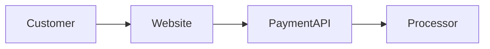

# PCI-DSS Compliance Assessment

Conduct a comprehensive PCI-DSS scope and compliance assessment.

## Workflow

### Step 1: Load Required Skills

Load these skills:

- `pci-dss-compliance` - PCI requirements and SAQ guidance
- `security-frameworks` - Security control mapping
- `data-classification` - Cardholder data identification

### Step 2: Spawn Security Auditor Agent

Spawn the `security-auditor` agent with the following prompt:

```text
Conduct a comprehensive PCI-DSS compliance assessment for: $ARGUMENTS

Perform the following assessments:

1. Scope Determination
   - Identify all cardholder data flows
   - Map the Cardholder Data Environment (CDE)
   - Identify connected systems
   - Evaluate scope reduction opportunities

2. SAQ Selection
   - Determine appropriate SAQ type
   - Validate SAQ eligibility
   - Identify any disqualifying factors

3. Scope Reduction Analysis
   - Tokenization opportunities
   - P2PE eligibility
   - Hosted payment page options
   - Network segmentation assessment

4. Requirement Assessment (12 Requirements)
   - Req 1-2: Network security
   - Req 3-4: Cardholder data protection
   - Req 5-6: Vulnerability management
   - Req 7-9: Access control
   - Req 10-11: Monitoring and testing
   - Req 12: Security policies

5. Gap Analysis
   - Compare current state to PCI DSS 4.0
   - Identify non-compliant controls
   - Prioritize by risk and deadline

6. Evidence Assessment
   - Review documentation
   - Assess scanning/testing evidence
   - Identify evidence gaps

Provide a complete PCI-DSS assessment with:
- Scope diagram and boundaries
- SAQ recommendation with justification
- Requirement-by-requirement assessment
- Prioritized remediation plan
```

### Step 3: Generate Assessment Report

Ensure the report includes:

- Executive summary with compliance status
- Scope diagram
- SAQ recommendation
- Detailed requirement assessment
- Remediation roadmap with PCI 4.0 deadlines

## Example Usage

```bash
# Assess an e-commerce checkout
/compliance-planning:assess-pci "e-commerce checkout using Stripe Elements"

# Assess a retail POS system
/compliance-planning:assess-pci "retail point-of-sale with P2PE terminals"

# Assess a payment gateway integration
/compliance-planning:assess-pci "custom payment processing with direct API integration"
```

## Output Format

````markdown
# PCI-DSS Assessment: [System Name]

## Executive Summary

### SAQ Type: [A / A-EP / B / B-IP / C / C-VT / D / P2PE]

### Overall Compliance: [COMPLIANT / PARTIAL / NON-COMPLIANT]

| Requirement | Status | Priority |
|-------------|--------|----------|
| 1. Network Security Controls | [Status] | [Priority] |
| 2. Secure Configuration | [Status] | [Priority] |
| ... | ... | ... |
| 12. Security Policies | [Status] | [Priority] |

---

## Scope Assessment

### Cardholder Data Flow


### CDE Boundaries

| System | In Scope | Reason |
|--------|----------|--------|

### Scope Reduction Opportunities

| Opportunity | Effort | Impact | Recommendation |
|-------------|--------|--------|----------------|

---

## SAQ Determination

### Recommended SAQ: [Type]

**Justification:**
[Why this SAQ applies]

**Eligibility Confirmation:**

- [ ] Criterion 1
- [ ] Criterion 2

---

## Requirement Assessment

### Requirement 1: Network Security Controls

| Sub-Req | Description | Status | Evidence | Gap |
|---------|-------------|--------|----------|-----|

[Continue for all 12 requirements]

---

## Gap Analysis

### Critical Gaps (Block Compliance)

| Gap | Requirement | Current State | Required State | Deadline |
|-----|-------------|---------------|----------------|----------|

### High Priority Gaps

| Gap | Requirement | Current State | Required State |
|-----|-------------|---------------|----------------|

---

## PCI DSS 4.0 Timeline

| Requirement | Status | Deadline | Action Required |
|-------------|--------|----------|-----------------|

---

## Remediation Roadmap

### Phase 1: Critical (Blocks Compliance)

1. [Action with owner and deadline]

### Phase 2: High Priority

1. [Action]

### Phase 3: Best Practices

1. [Action]

---

## Validation Requirements

- [ ] Quarterly ASV scans
- [ ] Annual penetration test
- [ ] Annual SAQ completion
- [ ] [Other requirements]

````
